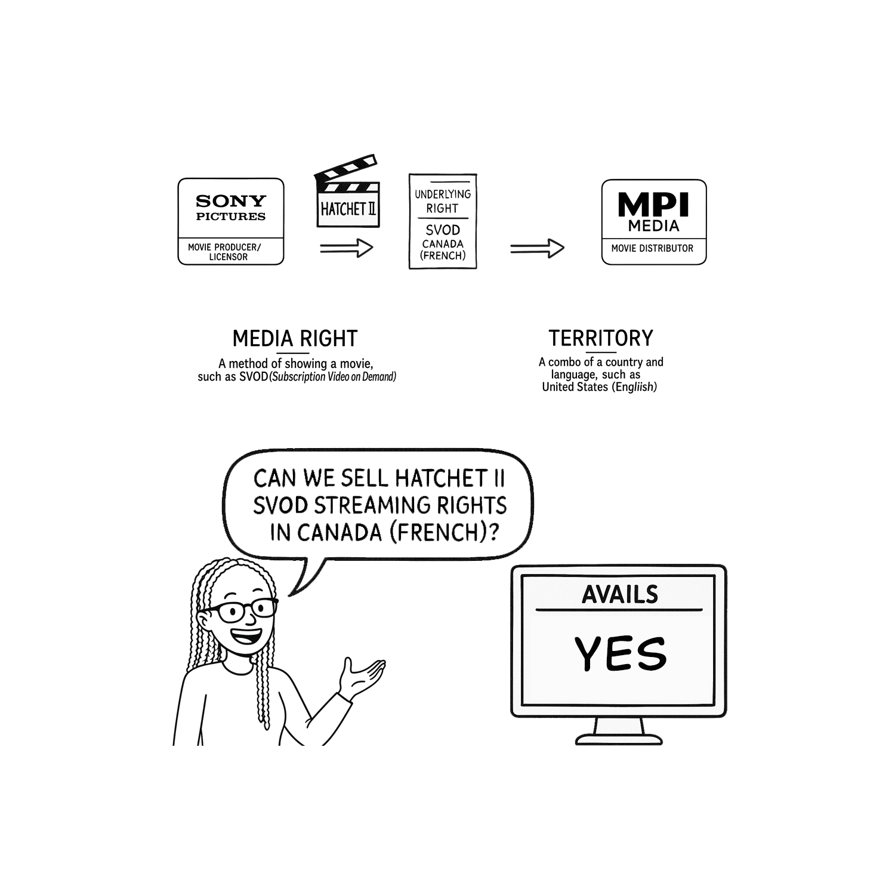
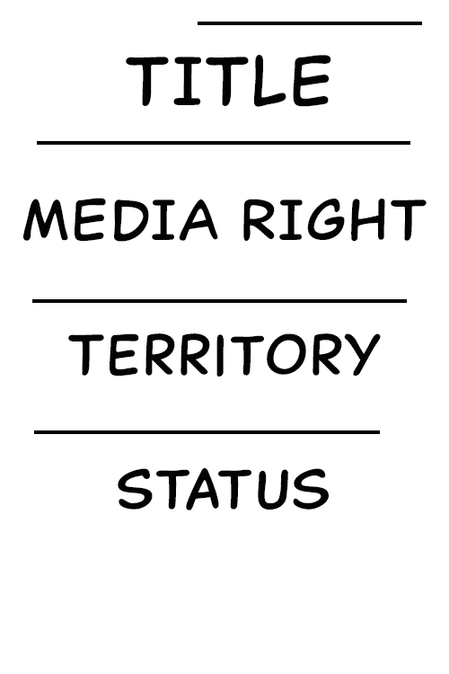
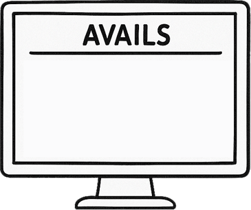

# 📚 Template Library Cheat Sheet

> **Tip:** To add an overall title at the top of your explainer image (e.g., "Underlying Rights Explained"), use the `template_title_card` as the first element in your template sequence. This allows you to set a custom heading for the entire image.

### template_explainer_full

### template_title_card

### template_definition_block

### template_salesperson_female

### template_salesperson_glasses

### template_media_right_definition

### template_licensor_box

### template_distributor_box

### template_contract_card

### template_avails_monitor

### template_arrows_set

